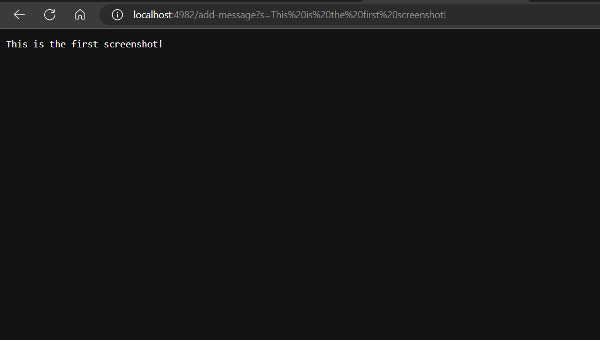
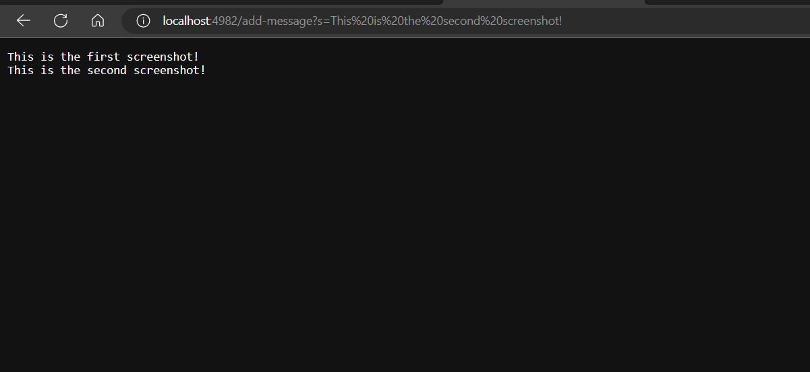
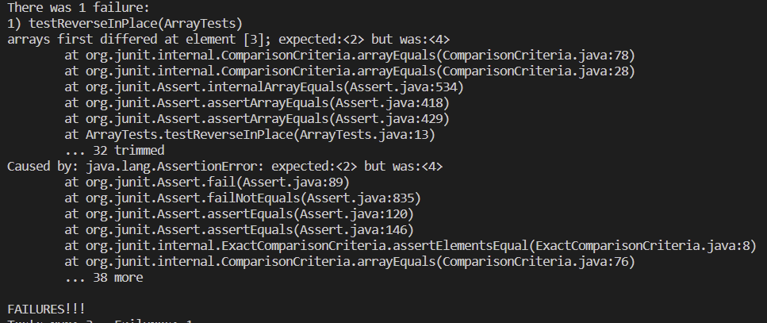

# Lab Report 2

## StringServer 

StringServer handles requests by supporting the path `/add-message` and taking a string query. The expected output should display each added string in a new line.
The following is the code used to launch the StringServer! We use an arraylist to store all of the input strings from the `add-message` request. To show the input strings
line by line, we use the `join` string method with `\n` as the delimiter.

```
import java.io.IOException;
import java.net.URI;
import java.util.ArrayList;

class Handler implements URLHandler{
    // Initialize a new array list to store the list of strings
    ArrayList<String> listofStrings = new ArrayList<>();

    public String handleRequest(URI url) {
        String urlPath = url.getPath();
        String urlQuery = url.getQuery();
        // Home Page
        if (urlPath.equals("/")) {
            return ("Welcome to Dom's String Server.\nBegin by adding a list of strings!");

        } else {
            System.out.println("Path: " + urlPath);// /add?s=
            // Adding Method
            if (urlPath.contains("/add-message") && urlQuery.contains("=")) {
                String[] parameters = url.getQuery().split("=");
                if (parameters[0].equals("s" )) {
                    listofStrings.add(parameters[1]);
                    return String.join("\n", listofStrings);
                } else {
                    return ("Invalid Query! Please type it as /add-message?s=<A String>!");
                }
            // Reseting the List
            } else if (urlPath.contains("/reset")){
                ArrayList<String> newListofStrings = new ArrayList<>();
                listofStrings = newListofStrings;
                return "Database Reset. Waiting for new inputs...";
            }
            return "404 Not Found!";
        }
    }
}

public class StringServer {
    public static void main(String[] args) throws IOException {
        if(args.length == 0){
            System.out.println("Missing port number! Try any number between 1024 to 49151");
            return;
        }

        int port = Integer.parseInt(args[0]);

        Server.start(port, new Handler());
    }
}

```
**First Screenshot Using `add-message`**



1. The method `handleRequest` is called when we hit enter after typing out the URL.  Inside `handleRequest`, 
we use two the built-in methods from the class URl: `getPath` and `getQuery` to manipulate the passed URL argument.
2. When launching the server for the first time, `handleRequest` is called
which passes, `"http://localhost:4982/add-message?s=This%20is%20the%20first%20screenshot!"` as the URL argument in the method's parameter. The first if statement takes `/` as the default path, leading to displayed message of the home page! In the screnshot above, the argument passed was the URL.
Its path and query is retrieved and is stored in the variables as followed: `urlPath` and `urlQuery`. 
`urlPath` stores `/add-message` while `urlQuery` stores `s=This is the first screenshot!`. 
3. Since `urlPath` contains `/add-message`, it enters the else's scope into the next if statement. Here `urlQuery` gets checked if it contains `=` which it does,
so the query string gets split with `=` as the delimiter. This manipulate the query string to be legible for our next move.
This generates a string array which is stored in the temporary `String [] parameters` variable which should only contains 2 elements: `{s, This is the first screenshot!}`.
It then goes through another block of conditional statement where it checks for the valid query, `?s=<String>`. If it does, it stores the 2nd element to the arraylist
and prints it out.

**Second Screenshot Using `/add-message`**



1. The method `handleRequest` is called when we hit enter after typing out the URL.  Inside `handleRequest`, 
we use two the built-in methods from the class URl: `getPath` and `getQuery` to manipulate the passed URL argument.
2. When launching the server for the first time, `handleRequest` is called
which passes, `"http://localhost:4982/add-message?s=This%20is%20the%20second%20screenshot!"` as the URL argument in the method's parameter. The first if statement takes `/` as the default path, leading to displayed message of the home page! In the screnshot above, the argument passed was the URL.
Its path and query is retrieved and is stored in the variables as followed: `urlPath` and `urlQuery`. 
`urlPath` stores `/add-message` while `urlQuery` stores `s=This is the second screenshot!`. 
3. Since `urlPath` contains `/add-message`, it enters the else's scope into the next if statement. Here `urlQuery` gets checked if it contains `=` which it does,
so the query string gets split with `=` as the delimiter. This manipulate the query string to be legible for our next move as it
generates a string array which is stored in the temporary `String [] parameters` variable which should only contains 2 elements: `{s, This is the second screenshot!}`.
It then goes through another block of conditional statement where it checks for the valid query, `?s=<String>`. If it does, it stores the 2nd element to the arraylist
and prints it out. Notice that the way it is being displayed is made possible using the `join` string method since we use `\n` as the delimiter.

## Debugging

1. Failure-Inducing Input:
```
    int[] input2 = {1, 2, 3, 4, 5};
    ArrayExamples.reverseInPlace(input2);
    assertArrayEquals(new int[]{5, 4, 3, 2, 1}, input2);
```
The output was `{5, 4, 3, 4, 5}` instead of `{5, 4, 3, 2, 1}`.

2. Normal Input:
```
    int[] input1 = { 2 };
    ArrayExamples.reverseInPlace(input1);
    assertArrayEquals(new int[]{ 2 }, input1);
```
3. Bug Output

Input2's Result:



Input1's Result:


4. Buggy Code (Before):
```
  static void reverseInPlace(int[] arr) {
    for(int i = 0; i < arr.length; i += 1) {
      arr[i] = arr[arr.length - i - 1];
    }
  }
```

After Changes:
```
   int[] correctResult = new int[arr.length];
    for(int i = 0; i < arr.length; i += 1) {
      correctResult[i] = arr[arr.length - i - 1];
     }
    for (int i = 0; i < arr.length; i++){
      arr[i] = correctResult[i];
    }
```

Effect of Changes: The method `reverseInPlace` takes in an `int[]` array and outputs the array with the elements in reversed order. The problem with the old implementation is that it only reverse the first half. This is because in the for loop, it using the same array to modify itself. This means that the first element will be modified to the last element of the same array, but once you reach the halfway, the next element won't be the old values because they were modified!

To solve this, the new implementation involves storing the correct output in a new array using a for loop. Then we use another for loop to replace each element of the old array with the correct output's elements.

## Reflection

In Lab 2, I learned about creating and launching my own web server! What was very exciting about this lab was also launching it to the remote server and being able to remotely access other people's server as well! I didn't know about this, and I thoroughly enjoy the process of modifying other people's search engine and number server. In Lab 3, what was new to me was the JUnit tests. I wasn't taught how to do Junits properly in CSE 11 or 12, and find that CSE15L had made it very easy for me to learn how it works alongside what it annotations meant and what were the different asserts. 
