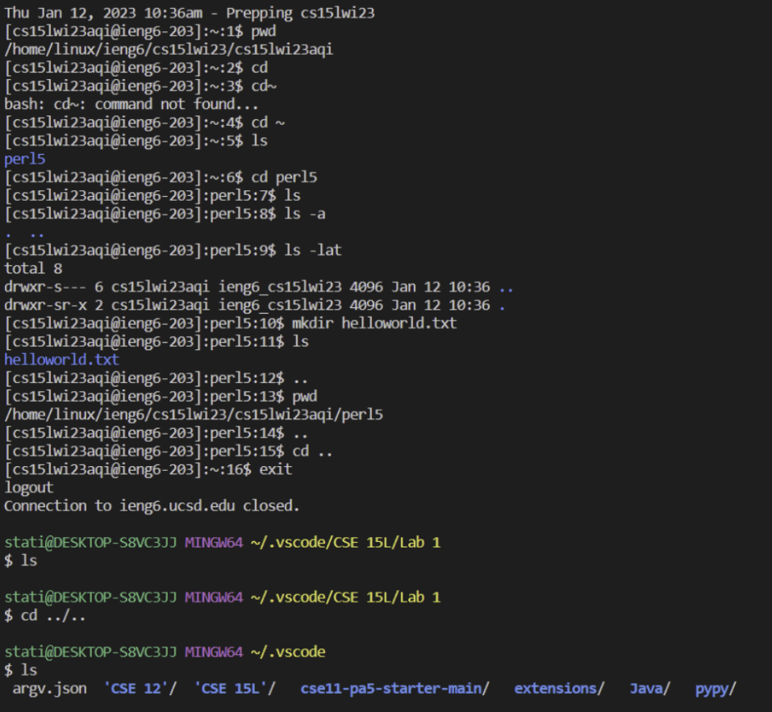

# Lab Report 1
This tutorial will make sure that you're competent in executing the following tasks:
1. Installing VSCode
2. Remotely Connecting using SSH
3. Running Commands in the Remote Server

> If on Windows, make sure to install GitBash since this will be the primary language used in the terminal.

---


## Installing VS Code
1. Head to the [link here](https://code.visualstudio.com/) to download and install the **latest version** of VSCode on your laptop. Make sure it's the right operating system.
2. Once installed, locate VScode in your file explorer (Windows) or Finder (MacOS) and open it. You should see the following after opening vscode:


## Remotely Connecting 
1. First, retrieve your course-specific account for CSE 15L [here](https://sdacs.ucsd.edu/~icc/index.php).
2. Input your username and PID as prompted (refer to the image below). To access your course specific account, we need to reset your password.


3. Click the blue button "Submit" and you should see a course specific account on the top under "Additional Accounts" that starts with cs15l.


4. Click on the course specific account and you should see a blue underlined text to change your password. Click on it.


5. **TRICKY PART!!** You will be redirected to a page that will ask you to input your username and PID again to access the global password reset page. Do as prompted and you should see the following. Make sure new password is complicated and do as prompted. Make sure that for the 2 dropdown boxes, your options should be selected like the image below. Once you finished typing your new password again under the "Confirm your password" tab, **hit enter! Do not click check password! 


6. Once everything goes right, you should see a pop up page that says your password change has been a success. Give it a grace period of 15 mins to have it enter the system. 
7. Go to VScode and open a terminal. Type `ssh`. Your command should look like the following, but with 'ABC' replaced by the letters in your course-specific account.

`$ ssh cs15lwi23ABC@ieng6.ucsd.edu`

8. Since this will be your first time connecting to the server, the following message will most likely pop up:

```
$ ssh cs15lwi23ABC@ieng6.ucsd.edu
The authenticity of host 'ieng6.ucsd.edu (128.54.70.227)' can't be established.
RSA key fingerprint is SHA256:ksruYwhnYH+sySHnHAtLUHngrPEyZTDl/1x99wUQcec.
Are you sure you want to continue connecting (yes/no/[fingerprint])? 
```
9. Make sure to type **yes** and hit enter. You will be prompted to give a password. Type your password and hit enter.
10. Overall, the entire process should resemble the following image. Keep in mind that this was done on a Windows laptop but the process should be very similar if done on a Mac.


7. Congratulation! You have connected your terminal to a computer in the CSE basement, so any commands you run will definitely run on that computer.


## Running Commands in the Remote Server
1. While connected to the remote server, try running some basic bash commands like `cd, pwd, ls, mkdir, cat, echo, cp, etc...`. 
2. To exit the server, just type `exit` in the terminal, and you should return to your local server.
3. Take a look at the following image which shows a few commands that I ran:



- `cd` refers to changing directory
- `pwd` refers to printing the current working directory. 
- `ls -a` lists the directory present including the hidden ones
- `ls -lat` combines the different options when listing. `l` lists all of the contents of a directory in a long format, as well as the file permissions. `t` order the files and directories by the time they were last modified.
