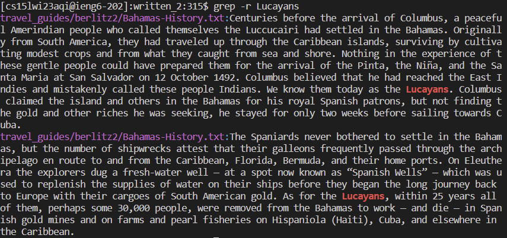
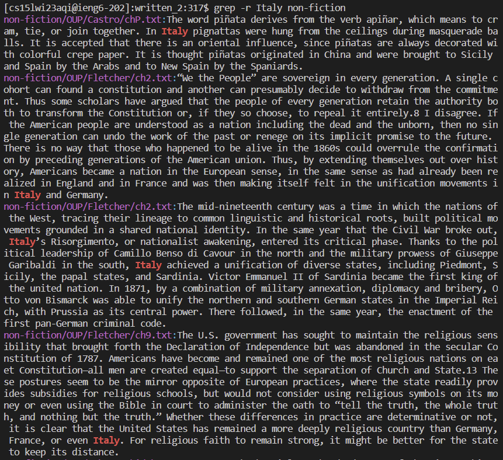
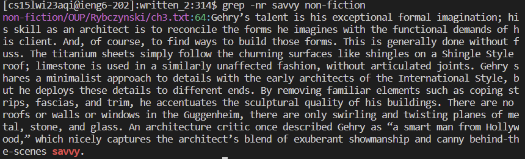
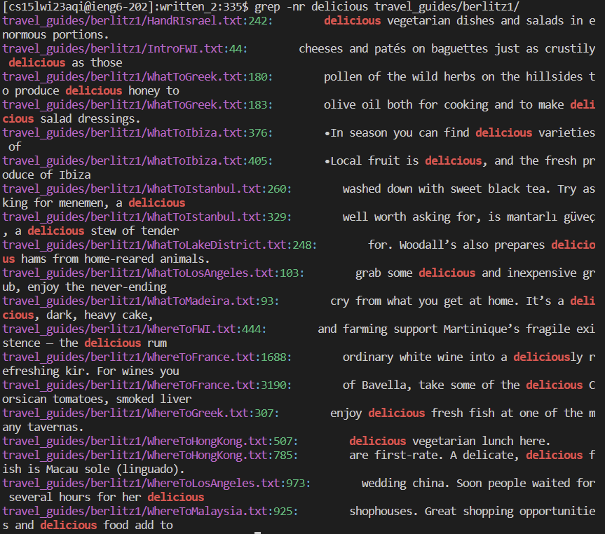

# Lab Report 3

## Grep Command-Line Options
1. [-r](#-r)
2. [-n](#-n)
3. [-c](#-c)
4. [-i](#-i)

[Grep Cmd-Line Source](https://www.geeksforgeeks.org/grep-command-in-unixlinux/)

---
## -r
### `$grep -r [string] [directory]`
This command outputs the searched pattern in the given directory recursively in all the files. 
It will go through each folder and its child directory to find the file that contains the matching
content. What makes this command very useful is that it saves us the time of having to specify a 
directory if we're trying to traverse everywhere. We can combine it with other commands to make searching
easier.
### Example 1:
#### `$grep -r Lucayans `

This recursively searches all of the folders and subdirectories of the working directory to find the file
that has Lucayans in it. By omitting the directory, it means that searches everything within the current working
directory.

### Example 2:
#### `$grep -r Italy non-fiction`

This recursively searches all of the folders and subdirectories of the working directory to find the file
that has Italy in it. This time, we're specifying the directory to `non-fiction` so bash is only recursively searching
inside that folder.

## -n
### `$grep -n [string] [directory]` 
This command show the line numebers of the file that matches the searched pattern.
It is useful if we're trying to narrow down the location of the string in a given file.

### Example 1:
#### `$grep -nr savvy`

This recursively look for `savvy` throughout the entire directory. We combined the command with -r to
make it easier to look everywhere.

### Example 2:
#### `$grep -nr delicious travel_guides/berlitz1`

This recursively look for `delicious` throughout the specified directory as mentioned above. We combined the command with -r to
make it easier to look everywhere.

