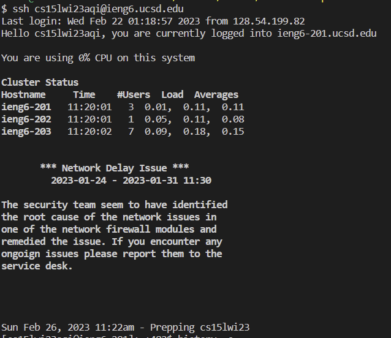
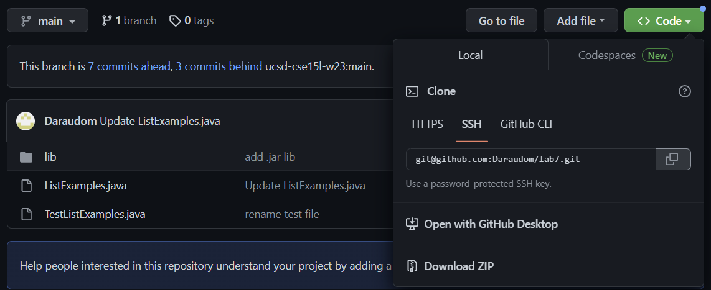

# Lab Report 4
The following lab report will demonstrate some git commands alongside file editing  using nano.
This will be a quick demo of Lab 7.

## 1. Logging Into ieng6

First, ssh into the remote server by typing: `ssh cs15lwi23xxx@ieng6.ucsd.edu`. This is already assuming you've completed the earlier steps of setting up a ssh key to avoid having to type the password all over again. Remember the `xxx` is your own privately assigned letters.

## 2. Cloning the fork of the Repository
Next, retrieve the ssh url of the file you're trying to clone from the forked repository. Refer
to the image below:

## 3. Running the Initial Test
## 4. Editing Code to Fix Test
## 5. Running Test to See Test Passes
## 6. Git Commit and Push
