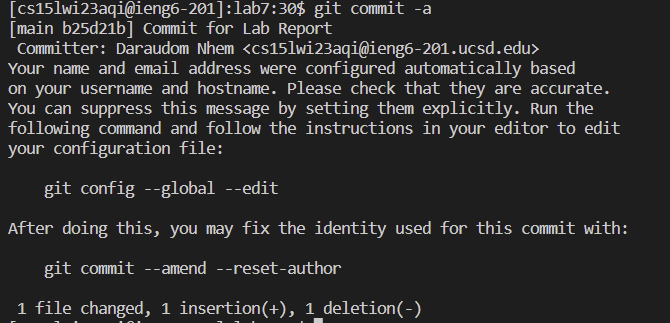
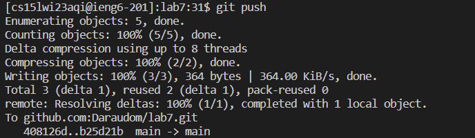

# Lab Report 4
The following lab report will demonstrate some git commands alongside file editing using nano.
This will be a quick demo of Lab 7 and note that this is done in a clean slate. This means that the bash history is cleared.

## 1. Logging Into ieng6


First, inside virtual studio code ssh into the remote server by typing: 
`ssh cs15lwi23xxx@ieng6.ucsd.edu`
This is already assuming you've completed the earlier steps of setting up a ssh key to avoid having to type the password all over again. Remember the `xxx` is your own privately assigned letters. Remember that `ssh` means "secured shell" which is used to access the remote server.

## 2. Cloning the fork of the Repository
Next, retrieve the `ssh url` of the file you're trying to clone from the forked repository. Refer
to the image below:


Next, head back to vsCode and clone the forked repository using the ssh link you copied to your clip board by typing the followingg:
`git clone <repo link>`
Recall that `git clone` is the command we used to clone a repository from github given its link. The output should look like the following:


## 3. Running the Initial Test
Next, `cd` into the repository folder to begin compiling the test. Recall that `cd` refers to changing directory. Inside the `Lab 7` directory, run the following command to compile and run the test. 
```
$javac -cp .:lib/hamcrest-core-1.3.jar:lib/junit-4.13.2.jar *.java
$java -cp .:lib/hamcrest-core-1.3.jar:lib/junit-4.13.2.jar org.junit.runner.JUnitCore TestListExamples
```
The output should look like the following image:


Notice that there's a test that failed.

## 4. Editing Code to Fix Test
To fix the code that causes the test to fail, type `nano TestListExamples.java` to fix the code. Notice that the old code says `index1 += 1`. Change it to 
`index2 += 1` according to the image below.


To save the file, type `^O` *(<Ctrl + O>)* to save the file and type `^X` *(<Ctrl + X>)* to exit from `nano`.

## 5. Running Test to See Test Passes
Next, recompile and run the test again. Since we've used the commands `javac -cp ...` and `java -cp ..` already before, we can call it again by pressing `^r` *<Ctrl + R>* and began typing `javac`. The result should pop up again. Hit *(enter)*. Likewise do the same for `java -cp..` by pressing `^r` *<Ctrl +r>*.


The test should appear that it passes.

## 6. Git Commit and Push

FInally, type `git commit -a`. The following screen should pop up.


Hit *< enter >* to begin typing a commit message. Hit *< esc >* to exit editor mode to view mode. Type `:wq` to commit the changes and exit. The output should look like the following image:

.

After that, type `git push` in the terminal to push the commited changes to remote server. The result should look like the following:

.


