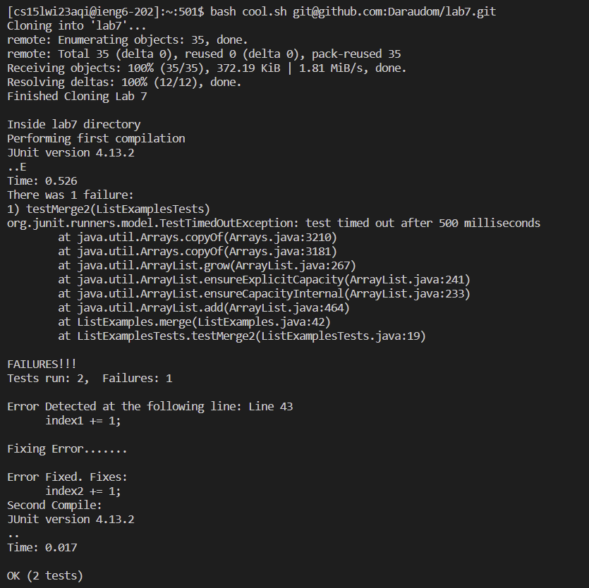
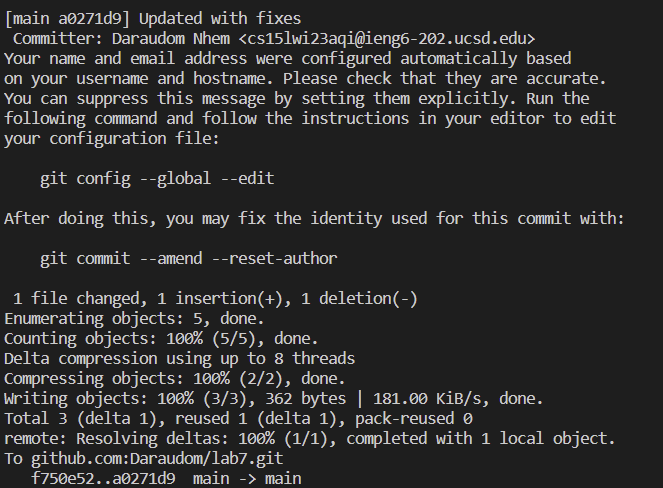
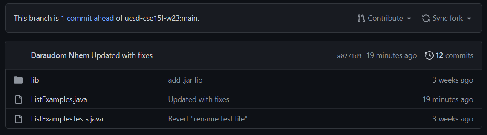

# Accelerating Lab 7 with Bash Scripts

Previously in lab 7, we weren’t allowed to utilize bash scripts to speed up our process to fix the bug and recompile the JUnit test to show it runs. Now, we will combine the power of bash scripts to run the entire thing with one bash script.

## Writing the Bash Script

### Step 1: Creating the File

At the beginning of the challenge, we want to start without the lab7 repository in our remote server as well making sure we forked the repo in our github. First, `ssh`to the remote server which should have the following format: `cs15lwi23xxx@ieng6.ucsd.edu`. `xxx`should be the three unique codes given to you at the beginning of class. Type `nano <name>.sh`to create a new file. For this report, I call it `cool.sh`. For the first line, type the following:

```bash
CPATH=".:lib/hamcrest-core-1.3.jar:lib/junit-4.13.2.jar"

#Remove the previous directory of lab7
rm -rf lab7
git clone $1
echo 'Finished Cloning Lab 7'
```

First, we declare a variable called `CPATH`which holds the value of the path that is needed to compile our test later. Below the first line of the comment, there are 3 lines of commands. 

`rm -rf lab7`: Removes recursively any folder that has the lab7 directory.

`git clone $1`: Clone the file which is the first argument given. In this case, the first argument will be the ssh link to the lab7 directory from our github.

`echo 'Finished Cloning Lab 7'`: Prints a line to show that the process works, indicating that lab 7 directory is cloned.

### Step 2: Change Directory to Lab 7 and Compile

Next, type the following code from the code snippet below.

```bash
# Change directory to lab 7
cd lab7
printf "\nInside lab7 directory\nPerforming first compilation\n"

#Compile the test file initially
javac -cp $CPATH *.java
java -cp $CPATH org.junit.runner.JUnitCore ListExamplesTests

printf "Error Detected at the following line: Line 43\n"
sed -n 43p ListExamples.java
```

`cd lab7`: change our directory to the cloned directory of lab7. There will be a prints statement below which let us know that we are inside the directory. Next, we write `javac -cp $CPATH *.java`to compile each file that has a `.java`extension. Next, we write `java -cp $CPATH org.junit.runner.JUnitCore ListExamplesTests`to run the test.

We will most definitely expect an error message to be printed out after running the tests. To be extra, you can have a little print statement below it to showcase the location of the bug in the file `ListExamples`. You can also use the `sed -n`command to print out the specific line of where that error occured. In this case, I typed `sed -n 43p ListExamples.java`because the bug is located in line 43 of that file. 

### Step 3: Fixing the Error and Compiling Again

After locating where the error is, we now want to fix it. Type the following code below:

```bash
printf "\nFixing Error.......\n"
sed -i '43s/index1/index2/' ListExamples.java

printf "\nError Fixed. Fixes:\n"
sed -n 43p ListExamples.java

#Second Compile
printf "Second Compile:\n"
javac -cp $CPATH *.java
java -cp $CPATH org.junit.runner.JUnitCore ListExamplesTests
```

The first print statement prints a line that show that we’re fixing the error. To fix the error, we use the command `sed -i '43s/index1/index2/' [ListExamples.java](http://ListExamples.java)`. The `-i`option for `-sed`means we’re editing the file in place. `43s`means we’re looking at Line 43 of `ListExamples.java` where the error is. Here, we want to sub out `index1`to`index2`. After this, we can type a print statement that tells us that error has been fixed. We can type `sed -n 43p ListExamples.java`to show the updated changes. The `-n`command options let us avoid printing other lines but the specified line which is `43p`.

In the next line we want to compile the file again. Same as before, type `javac -cp $CPATH *.java`then in the next line, type `java -cp $CPATH org.junit.runner.JUnitCOre ListExamplesTests`.

We definitely expect an output that shows that all of our tests passed this time!

### Step 4: Git Add, Commit, Push

After making the changes, we would need to commit and push our changes to github. Type the following code below. Read the annotations below the code snippet to know what each line does.

```bash
#git commit + add
git add ListExamples.java
git commit -m "Updated with fixes"

#Pushing to the origin
git push origin main
```

`git add ListExamples.java`: brings the the file `ListExamples.java`to the staging area.

`git commit -m "Updated with fixes"`: commit the changes made with a commit message added. In this case, I left the message as “Updated with fixes”.

`git push origin main`: Push the commited file to our main branch.

## Testing the Script

Combining everything we wrote earlier into one file, the following is our outcome.

### Script Overview

```bash
CPATH=".:lib/hamcrest-core-1.3.jar:lib/junit-4.13.2.jar"

# Remove previous directory of lab7
rm -rf lab7
git clone $1
echo 'Finished Cloning Lab 7'

# Change directory to lab 7
cd lab7
printf "\nInside lab7 directory\nPerforming first compilation\n"

#Compile the test file initially
javac -cp $CPATH *.java
java -cp $CPATH org.junit.runner.JUnitCore ListExamplesTests

printf "Error Detected at the following line: Line 43\n"
sed -n 43p ListExamples.java

printf "\nFixing Error.......\n"
sed -i '43s/index1/index2/' ListExamples.java

printf "\nError Fixed. Fixes:\n"
sed -n 43p ListExamples.java

#Second Compile
printf "Second Compile:\n"
javac -cp $CPATH *.java
java -cp $CPATH org.junit.runner.JUnitCore ListExamplesTests

#git commit + add
git add ListExamples.java
git commit -m "Updated with fixes"

#Pushing to the origin
git push origin main
```

### Output of the Script

To run the script, type `bash cool.sh <ssh link to lab7 repo>`.





## Conclusion

In case there’s another challenge that allows bash scripts writing, this can be used to instantly finish the lab7 challenge. Here’s the outcome after running the bash script: We can see that our changes got updated to our github.


